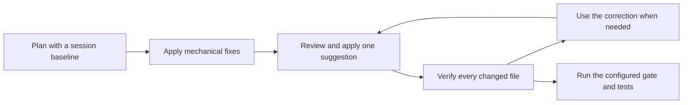

A long file needs a concrete next step, not another request to make it shorter. Iris Code builds a deterministic plan, applies proved mechanical fixes and verifies the changes against an owned baseline.

## Acting on the results

**Refactor plan** on the File, Folder or Workspace tab opens the Refactor Playbook panel, in VS Code and in JetBrains IDEs. Opening the panel reads nothing. **Get plan** reads the eligible sources locally, including unsaved editor changes, to detect conventions and import context, and keeps that snapshot in editor memory as the baseline for verification. Only the scope you chose is planned, and asking for a new plan replaces the baseline. File plans and verification are free; folder and workspace plans require **Iris Code Pro**, in the editor and over MCP.

| Part | Purpose | Output |
|---|---|---|
| Mechanical fixes | Edit only where the lexical boundary and lack of side effects are proved | Previewable replacements or deletions |
| Conventions | Prefer the repository's observed layout | Detected, configured or proposed destinations |
| Suggestions | Give a human or coding agent an ordered structural plan | Risk, ranges, estimated effect and instructions |
| Verification | Find regressions and artificial line reductions | Improved, not-improved or regressed, with reasons and correction |

**Apply mechanical fixes** makes one undoable editor change and reports a summary with **Undo**. Structural suggestions are instructions to review; the editor does not apply them. **Open agent instructions** shows the plan as readable instructions and exact JSON for a coding agent, and **Verify refactor** and **Copy correction for your agent** close the loop.

## Free and Pro

| Surface | Free | Pro |
|---|---|---|
| File plan and verification | Yes | Yes |
| Top-level refactor settings | Yes | Yes |
| Language overrides | Ignored with a warning | Applied |
| Folder and workspace plans in the editor | Requires Pro | Available |
| MCP folder and workspace scope | Requires Pro | Available |

Iris Code does not call a model. Verification is advisory and cannot establish semantic equivalence; tests and a reviewed diff remain necessary. It does not change the gate or a push/build hook result. The Playground does not expose the refactor playbook.

## Related pages

[Overview](/refactor/overview), [fixes and suggestions](/refactor/reference), [conventions](/refactor/conventions), [verification](/refactor/verification), [configuration](/refactor/configuration), [agent integration](/refactor/agents), and [language coverage](/refactor/language-coverage).
